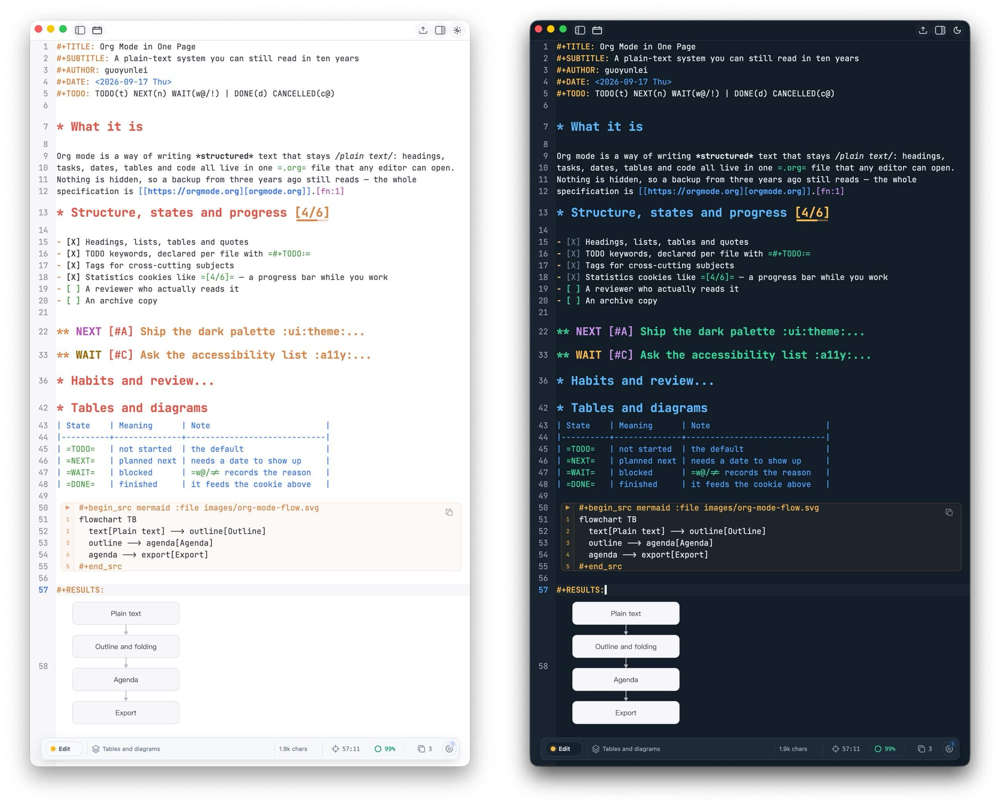

* Org Studio

A native macOS studio for Org mode and Markdown

Org Studio opens your Org and Markdown files and gives plain text the three
things it usually lacks: *a fast editor*, *a beautiful reading view* and *a home
for your tasks*. Native, GPU-rendered, written in Rust.

** Screenshots

** What you get

- *Fast on real documents.* Parsing is incremental and the reading view and
  minimap render only what is on screen, so very large files still scroll
  smoothly and are never re-parsed as you scroll.
- *A minimap that knows the document.* Not just a blur of text: headings, blocks
  and even diagrams and images are mirrored, and the viewport stays pinned while
  you resize the window.
- *A reading view worth reading.* Tables, quotes, blocks, footnotes, tags and
  timestamps render properly; PlantUML, Mermaid and Typst source blocks become
  diagrams and can write their results back to the file.
- *Rich inline detail.* TODO keywords, priorities, tags, dates and statistics
  cookies such as =[4/7]= become *live, styled objects* — a section's progress is
  visible right in the source you are editing.
- *A status line you can click.* Mode, heading path, caret or source position,
  reading progress, word count and file format are all buttons: click to change
  mode, jump to the heading, open the document map, and let the rest fold away
  when the pane gets narrow.
- *Tasks that stay in the text.* Agendas gather headings from many files with
  filters and saved views; clock logging, habit streaks and
  =SCHEDULED=/=DEADLINE= handling live next to the prose, not in a separate app.
- *Themes and reading styles.* Light, dark or follow the system, plus a warm
  reading style for long sessions, and per-pane content font size.
- *Keyboard-first.* Emacs-style prefixes (~C-x C-s~, ~C-c C-c~, ~C-c a~) next to
  macOS shortcuts (=⌘1= / =⌘2= / =⌘3=, =⌘B=, =⌥⌘M=), and several documents in one
  window with save review and external-change handling.

** Install

#+begin_src sh
./scripts/install-macos.sh      # installs ~/Applications/Org Studio.app
org-studio notes.org            # or: org-studio log.md
#+end_src

Make sure =~/.local/bin= is in =PATH=. Override the locations with
=ORG_STUDIO_APP_DIR= and =ORG_STUDIO_BIN_DIR=. Finder, drag-and-drop and =open=
all route to the running window.

** Build

#+begin_src sh
cargo test
./scripts/package-macos.sh      # builds "Org Studio.app" into dist/
#+end_src

The first build fetches the GUI toolkit from GitHub; later builds are
incremental.

** Licensing

Org Studio is free software: *GNU General Public License v3 or later*. See
[[file:LICENSE][LICENSE]]. Copyright (C) 2026 guoyunlei.
