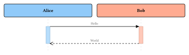
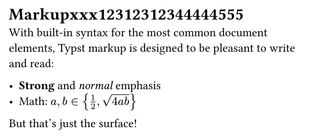

#+title: Org Studio Preview
#+author: Org Studio

* Overview

This paragraph contains *bold*, /italic/, _underline_, +strike+, ~code~, =verbatim=,
an [[https://example.com][external link]], and a timestamp <2026-08-24 Mon>.
Entity \alpha and LaTeX fragments $x^2$ and \(y + 1\) remain visible.

** TODO Tasks :preview:

- [ ] Render headings
- [X] Render lists
  - Nested list text
1. Ordered item

** Properties

:PROPERTIES:
:ID:       preview-fixture
:CUSTOM_ID: basics
:END:

** Table

| Feature   | Status |
|-----------+--------|
| Heading   | Done   |
| Paragraph | Done   |

** Source

#+begin_src rust
fn main() {
    println!("Org Studio");
}
#+end_src

#+begin_quote
Native Rust and GPUI preview.
#+end_quote

#+begin_src plantuml :file images/login.svg
  @startuml
  Alice -> Bob: Hello
  Bob --> Alice: World
  @enduml
#+end_src

#+RESULTS:

#+begin_src typst :file images/typst-demo.svg
#set page(width: 640pt, height: auto, margin: 18pt)
#set text(size: 24pt)
= Markup
With built-in syntax for the most common document elements, Typst markup is designed to be pleasant to write and read:

- *Strong* and _normal_ emphasis
- Math: $a, b in { 1/2, sqrt(4 a b) }$

But that's just the surface!
#+end_src

#+RESULTS:

** 中文与 Unicode

中文段落、emoji 😀、组合字符 é 应当保持完整。

